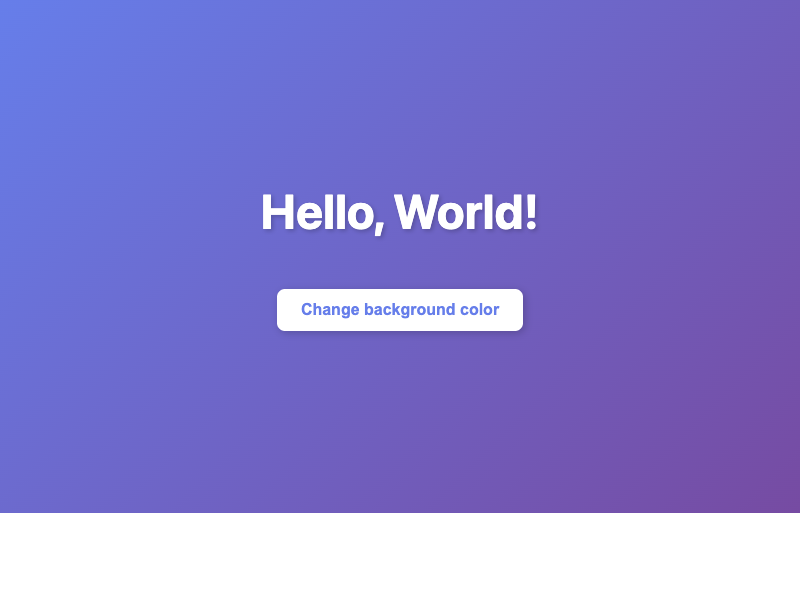

# Vibe Coding Experiments

## hello-world-claude-code

A simple interactive "Hello World" web page created with Claude Code. Features a centered greeting on a colorful gradient background with a button that randomly cycles through different gradient color schemes.

